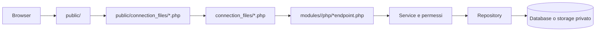

# Architettura di MyOrari

## Obiettivo

MyOrari è organizzata per domini funzionali. Il browser accede soltanto alla cartella `public/`; configurazione, logica PHP, dipendenze, dati e script operativi rimangono fuori dalla DocumentRoot.

## Struttura principale

```text
App_iperal-1/
|-- public/                 DocumentRoot e superficie raggiungibile dal browser
|   |-- assets/             JavaScript e CSS
|   |-- connection_files/   Wrapper degli endpoint pubblici
|   |-- img/                Immagini e icone
|   `-- *.php               Pagine, manifest e service worker
|-- modules/                Logica organizzata per dominio
|-- connection_files/       Wrapper PHP interni e compatibilità storica
|-- database/               Schema e migrazioni
|-- deploy/                 Configurazione del server
|-- scripts/                Release, backup e controlli post-deploy
|-- storage/                Dati applicativi non pubblici
|-- vendor/                 Dipendenze Composer
|-- app_config.php          Configurazione applicativa condivisa
|-- app_local_env.php       Segreti locali, non versionati
`-- session_bootstrap.php   Avvio e protezione della sessione
```

## Flusso di una richiesta



I wrapper mantengono stabili gli URL già usati dal frontend e dalla PWA. La logica applicativa non deve essere duplicata nei wrapper: essi caricano il corrispondente endpoint interno.

## Confine pubblico

| Area | Pubblica | Responsabilità |
| --- | --- | --- |
| `public/*.php` | Sì | Pagine HTML, manifest e service worker. |
| `public/assets/` | Sì | Asset statici caricati dal browser. |
| `public/img/` | Sì | Avatar, icone e immagini UI. |
| `public/connection_files/` | Sì | Wrapper degli endpoint consentiti. |
| `modules/` | No | Regole di business e accesso ai dati. |
| `connection_files/` | No | Compatibilità PHP interna e bootstrap. |
| `database/`, `scripts/`, `deploy/` | No | Operazioni amministrative. |
| `storage/`, `turni_json/`, `note_json/`, `xlms/` | No | Dati applicativi. |
| `app_local_env.php` | No | Credenziali e segreti. |

Apache deve avere come DocumentRoot esclusivamente `public/`. I blocchi presenti in `public/.htaccess` e `deploy/apache/myorari-security.conf` aggiungono una seconda protezione, ma non sostituiscono questo confine.

## Struttura di un modulo

Un modulo può contenere soltanto le cartelle necessarie:

```text
modules/<nome>/
`-- php/
    |-- bootstrap.php
    |-- endpoints o router
    |-- permissions/
    |-- repositories/
    |-- services/
    `-- support/
```

- Gli endpoint interpretano la richiesta e restituiscono la risposta.
- I permessi decidono chi può leggere o modificare.
- I service coordinano i casi d'uso.
- I repository eseguono query e operazioni di persistenza.
- `support/` contiene validazioni, formattatori e risposte condivise nel modulo.
- Il JavaScript specifico vive in `public/assets/js/modules/<nome>/`.
- Il CSS specifico vive in `public/assets/css/modules/`.

Il codice condiviso tra più domini deve stare in un'area comune coerente con la sua responsabilità. Non deve essere copiato tra moduli.

## Configurazione e dati

`app_config.php` legge i valori da ambiente e da `app_local_env.php`. Il file locale non deve essere versionato né servito dal web server.

Le modifiche allo schema sono dichiarate in `database/schema.sql` e applicate tramite:

```sh
php database/migrate.php
```

Le richieste utente non devono creare o modificare automaticamente lo schema.

## PWA e versionamento

`public/manifest.php` e `public/service-worker.php` generano contenuti usando `APP_VERSION`. Gli asset cacheabili includono la versione nell'URL; ogni rilascio che modifica frontend o cache deve incrementarla.

Le release sono coordinate da `scripts/release.php` e registrate anche in `release_meta.json`.

## Aggiunta di un nuovo modulo

1. Creare `modules/<nome>/php/` con responsabilità separate.
2. Aggiungere un endpoint interno sottile.
3. Conservare o creare il wrapper in `connection_files/`.
4. Esporre soltanto il wrapper necessario in `public/connection_files/`.
5. Collocare JS e CSS nelle cartelle pubbliche del modulo.
6. Definire permessi, dati e dipendenze.
7. Aggiornare `docs/modules/<nome>.md` e l'indice della documentazione.
8. Aggiungere test tecnici e casi manuali proporzionati al rischio.
