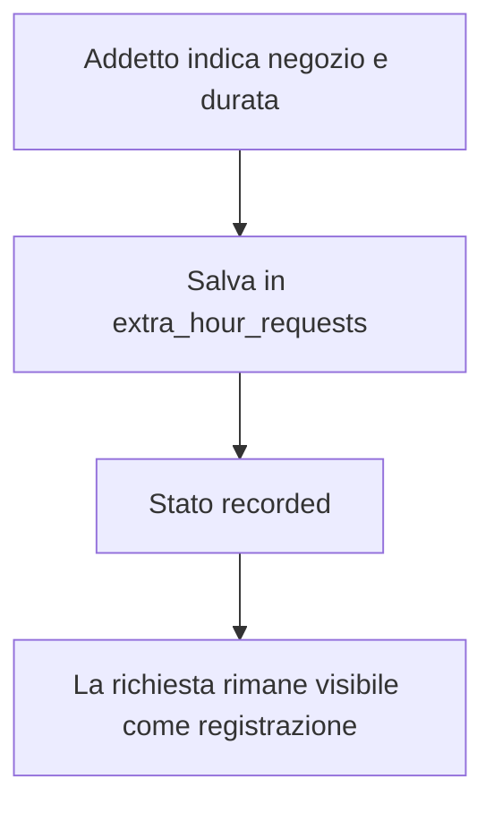

# Modulo Richieste Ore

## Scopo

Il modulo richieste ore gestisce tre flussi collegati agli orari effettivi:

- variazione del proprio turno giornaliero;
- segnalazione di ore svolte in un altro reparto;
- segnalazione di ore svolte in un altro negozio o ipermercato.

Il modulo e pensato per mantenere separata la richiesta dell'addetto dalla decisione del responsabile. Le ore in altro reparto richiedono una doppia approvazione: responsabile del reparto di origine e responsabile del reparto di destinazione.

## File principali

| Area | File | Responsabilita |
| --- | --- | --- |
| Endpoint pubblico | `connection_files/schedule_adjustments.php` | Wrapper compatibile con il frontend esistente. |
| Controller modulo | `modules/adjustments/php/schedule_adjustments_endpoint.php` | Routing GET/POST, transazioni, invio notifiche push. |
| Bootstrap | `modules/adjustments/php/bootstrap.php` | Carica sessione, connessione, push, libreria orari e file del modulo. |
| Risposte | `modules/adjustments/php/support/response.php` | Output JSON standard. |
| Formatter | `modules/adjustments/php/support/formatters.php` | Normalizza dati per la UI e ordina le richieste. |
| Permessi | `modules/adjustments/php/permissions/adjustment_permissions.php` | Controlla ruoli e lati approvabili nelle ore extra reparto. |
| Repository variazioni | `modules/adjustments/php/repositories/schedule_adjustment_repository.php` | Lettura richieste di variazione turno. |
| Repository ore extra | `modules/adjustments/php/repositories/extra_hour_repository.php` | Lettura richieste ore extra e mapping per la UI. |
| JS modulo | `assets/js/modules/adjustments/adjustments.js` | Pannelli UI, form, fetch, azioni di approvazione/rifiuto. |
| Libreria condivisa | `connection_files/schedule_adjustment_lib.php` | Wrapper compatibile verso le funzioni condivise del modulo Orari. |

## Tabelle database

| Tabella | Uso |
| --- | --- |
| `schedule_adjustment_requests` | Richieste di variazione del turno giornaliero. |
| `extra_hour_requests` | Ore extra in altro reparto o altro negozio. |

## Ruoli e visibilita

| Ruolo | Vista UI | Azioni principali |
| --- | --- | --- |
| Addetto (`capo = 0`) | Vede le proprie richieste. | Crea variazioni turno, ore in altro reparto, ore in altro negozio. |
| Vice (`capo = 2`) | Vede le proprie richieste. | Come addetto; non approva. |
| Caporeparto (`capo = 1`) | Vede richieste del proprio reparto e ore extra dove il reparto e origine o destinazione. | Approva/rifiuta richieste non proprie. |
| Admin (`capo = 3`) | Vede tutte le richieste. | Approva/rifiuta per sviluppo, emergenza e controllo globale. |

## Flusso variazione turno

```mermaid
flowchart TD
    A["Addetto apre il giorno in calendario"] --> B["Inserisce nuovo turno richiesto"]
    B --> C["Endpoint confronta reparto, settimana e turno originale"]
    C --> D{ "Esiste gia una richiesta aperta o approvata?" }
    D -- "Si" --> E["Errore o conflitto"]
    D -- "No" --> F["Salva in schedule_adjustment_requests"]
    F --> G["Notifica caporeparto/admin"]
    G --> H["Capo o admin approva/rifiuta"]
    H --> I["Notifica esito all'addetto"]
```

## Flusso ore in altro reparto

```mermaid
flowchart TD
    A["Addetto indica reparto destinazione e durata"] --> B["Salva in extra_hour_requests con stato pending"]
    B --> C["Notifica responsabili reparto origine e destinazione"]
    C --> D["Responsabile origine decide il proprio lato"]
    C --> E["Responsabile destinazione decide il proprio lato"]
    D --> F{ "Entrambi approvati?" }
    E --> F
    F -- "Si" --> G["Stato finale approved"]
    F -- "Uno rifiutato" --> H["Stato finale rejected"]
    G --> I["Notifica esito all'addetto"]
    H --> I
```

## Flusso ore in altro negozio



## Note tecniche

- `connection_files/schedule_adjustment_lib.php` resta come wrapper compatibile; la logica condivisa vive in `modules/schedules/php/shared`.
- L'endpoint pubblico non cambia URL, quindi il frontend non richiede modifiche.
- Il controller del modulo mantiene le transazioni e le notifiche push nello stesso punto per non alterare il comportamento esistente durante il refactor.
- Una futura fase potra estrarre i service applicativi, ma conviene farlo con test di integrazione sulle approvazioni e sulle notifiche.
