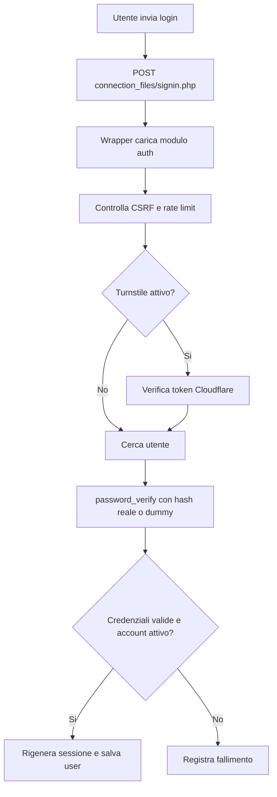
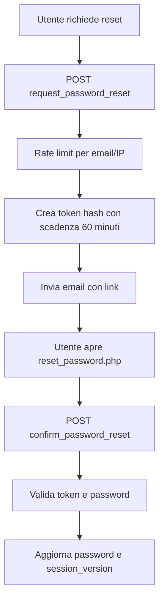

# Modulo Autenticazione e Account

## Scopo

Il modulo Auth raccoglie login, registrazione autonoma, stato sessione, logout, reset password e funzioni di identita account. Gli URL pubblici restano invariati per non modificare form e chiamate JavaScript esistenti.

## File principali

| Area | File | Responsabilita |
| --- | --- | --- |
| Bootstrap | `modules/auth/php/bootstrap.php` | Sessione, configurazione e connessione database. |
| Login | `modules/auth/php/endpoints/signin_endpoint.php` | Autenticazione, rate limit, Turnstile e creazione sessione. |
| Registrazione | `modules/auth/php/endpoints/signup_endpoint.php` | Registrazione autonoma quando abilitata. |
| Stato sessione | `modules/auth/php/endpoints/check_login_endpoint.php` | Verifica sessione lato frontend. |
| Logout | `modules/auth/php/endpoints/logout_endpoint.php` | Chiusura sessione con CSRF. |
| Richiesta reset | `modules/auth/php/endpoints/request_password_reset_endpoint.php` | Genera token e invia email reset. |
| Conferma reset | `modules/auth/php/endpoints/confirm_password_reset_endpoint.php` | Aggiorna password e invalida sessioni. |
| Identita | `modules/auth/php/identity/account_identity.php` | Generazione badge e identificativi tecnici. |
| Mail account | `modules/auth/php/mail/password_reset_mail.php` | SMTP/Brevo e template email invito/reset. |
| Wrapper pubblici | `connection_files/*.php`, `account_identity.php` | Compatibilita con URL e include esistenti. |

## Flusso login

## Flusso reset password

## Note tecniche

- Gli endpoint pubblici non cambiano: `connection_files/signin.php`, `signup.php`, `logout.php`, `check_login.php`, `request_password_reset.php`, `confirm_password_reset.php`.
- `account_identity.php` resta nella root come wrapper per compatibilita con inviti e registrazione.
- Le email account sono nel modulo auth, ma sono ancora usate anche dal modulo users per gli inviti.
- La cartella `modules/` e bloccata via HTTP: il browser deve passare dai wrapper pubblici.
