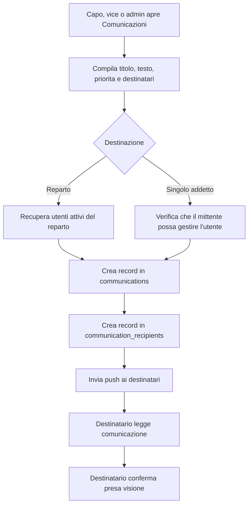
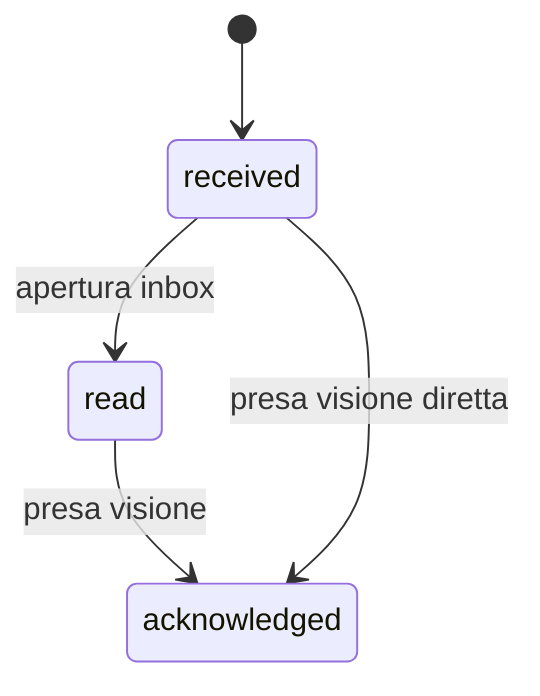

# Modulo Comunicazioni

## Scopo Del Modulo

Il modulo comunicazioni gestisce l'invio, la ricezione, la lettura e la presa visione delle comunicazioni interne all'app.

Le comunicazioni possono essere inviate da figure abilitate verso:

- tutto un reparto
- un singolo addetto

Ogni destinatario ha uno stato personale di lettura e conferma tramite `communication_recipients`.

## Schermate

| Schermata | Funzione | File JS principale |
| --- | --- | --- |
| Comunicazioni ricevute | Mostra inbox personale e permette la presa visione | `assets/js/modules/communications/communications.js` |
| Nuova comunicazione | Permette a capo/vice/admin di inviare comunicazioni | `assets/js/modules/communications/communications.js` |
| Comunicazioni inviate | Mostra riepilogo destinatari, letture e conferme | `assets/js/modules/communications/communications.js` |

Il modulo viene caricato dal loader frontend in `app_core.js` tramite la feature `communications`.

## Workflow Generale



## Ruoli E Permessi

| Ruolo | Valore `capo` | Cosa puo fare |
| --- | ---: | --- |
| Addetto | `0` | Legge e conferma le proprie comunicazioni |
| Caporeparto | `1` | Invia al proprio reparto o a singoli addetti del proprio reparto; vede le proprie inviate |
| Vice | `2` | Stessa logica operativa del capo per le comunicazioni |
| Admin | `3` | Invia a qualunque reparto o singolo utente attivo; vede le comunicazioni inviate globali |

Note importanti:

- Tutti gli utenti possono ricevere comunicazioni.
- Solo capo, vice e admin possono inviare comunicazioni.
- Capo e vice sono limitati al proprio reparto.
- Admin puo scegliere tutti i reparti e tutti gli utenti attivi.

## Flussi Principali

### Inbox

1. L'utente apre `Comunicazioni`.
2. Il frontend chiama `connection_files/communications.php?view=inbox`.
3. Il backend restituisce le comunicazioni destinate all'utente.
4. Le comunicazioni non lette vengono marcate come lette tramite `read_at`.
5. Se manca `acknowledged_at`, la UI mostra il pulsante `Presa visione`.

### Presa Visione

1. L'utente clicca `Presa visione`.
2. Il frontend invia `POST action=acknowledge` con `communication_id`.
3. Il backend aggiorna `read_at` se mancante e imposta `acknowledged_at`.
4. La UI svuota la cache comunicazioni e ricarica la vista.

### Invio Comunicazione

1. Capo, vice o admin compila il form.
2. Il backend valida titolo, messaggio e priorita.
3. Se la destinazione e `department`, recupera gli utenti attivi del reparto.
4. Se la destinazione e `user`, verifica che il mittente possa gestire quel destinatario.
5. Crea `communications` e i relativi `communication_recipients`.
6. Invia una push a ogni destinatario.

### Comunicazioni Inviate

1. Capo, vice o admin apre la sezione comunicazioni.
2. Il frontend chiama `connection_files/communications.php?view=sent`.
3. Capo e vice vedono le comunicazioni di cui sono autori.
4. Admin vede il riepilogo globale.
5. La UI mostra destinatari, letture e conferme.

## Stati Lettura



| Campo | Significato |
| --- | --- |
| `read_at` | La comunicazione e stata aperta nell'inbox del destinatario |
| `acknowledged_at` | Il destinatario ha confermato presa visione |

## Tabelle Database

### `communications`

Contiene il contenuto della comunicazione.

Campi principali:

- `id`
- `author_cf`
- `title`
- `message`
- `priority`
- `created_at`

### `communication_recipients`

Contiene lo stato personale per ogni destinatario.

Campi principali:

- `communication_id`
- `recipient_cf`
- `read_at`
- `acknowledged_at`

La chiave primaria e composta da `communication_id` e `recipient_cf`.

## Endpoint Pubblico

| Endpoint | Scopo | Implementazione modulare |
| --- | --- | --- |
| `connection_files/communications.php` | Inbox, utenti destinatari, inviate, presa visione e invio | `modules/communications/php/communications_endpoint.php` |

L'endpoint pubblico resta in `connection_files` per non rompere fetch frontend, notifiche e link gia distribuiti.

## Struttura Codice

```text
assets/js/modules/communications/
  communications.js

modules/communications/php/
  bootstrap.php
  communications_endpoint.php
  permissions/
    communication_permissions.php
  repositories/
    communication_repository.php
  services/
    communication_service.php
  support/
    response.php
```

Responsabilita:

- `endpoint`: legge richiesta, controlla sessione/CSRF, chiama service e risponde JSON.
- `service`: valida input, coordina destinatari, invio e push.
- `repository`: contiene query e scritture database.
- `permissions`: contiene regole per ruolo, reparto e destinatari.
- `support`: contiene helper piccoli come la risposta JSON.

## Notifiche

Quando una comunicazione viene inviata, il backend prova a inviare una push a ogni destinatario con payload:

- `type = communication`
- `title = Nuova comunicazione` oppure `Comunicazione importante`
- `url = ./index.php?communications=1`
- `communication_id`

Il centro notifiche legge `communication_recipients` e mostra un conteggio basato su comunicazioni non lette o non confermate.

## Regole Di Business

- Ogni destinatario ha il proprio stato di lettura e presa visione.
- Aprire l'inbox marca come lette le comunicazioni non lette.
- La presa visione e esplicita e salva `acknowledged_at`.
- Capo e vice possono inviare solo al proprio reparto o ad addetti del proprio reparto.
- Admin puo inviare a tutti i reparti o a qualunque utente attivo.
- Le push sono best effort: se una push fallisce, la comunicazione resta comunque salvata.

## Dipendenze Esterne Al Modulo

Il modulo comunicazioni usa alcune funzioni condivise esistenti fuori dal modulo:

- `app_csrf_request_is_valid()` per protezione POST.
- `appIsValidDepartment()` per validare i reparti.
- `appPushSendPayload()` da `connection_files/push_lib.php`.
- `notification_center.php`, che calcola i badge comunicazioni leggendo `communication_recipients`.

Queste dipendenze sono candidate future per una cartella `shared`.

## Test Manuali Consigliati

Prima di considerare stabile una modifica al modulo comunicazioni, verificare:

- Addetto apre comunicazioni e vede inbox.
- Addetto puo cliccare `Presa visione`.
- Capo invia comunicazione al proprio reparto.
- Capo invia comunicazione a un singolo addetto del proprio reparto.
- Capo non puo inviare ad addetti di altri reparti.
- Admin puo scegliere reparto e singolo addetto.
- La sezione `Inviate` mostra destinatari, lette e confermate.
- Il badge notifiche cambia dopo apertura o presa visione.

## Test Tecnici Consigliati

- `php -l` su tutti i file `modules/communications/php`.
- `node --check` su `assets/js/modules/communications/communications.js`.
- Smoke test CLI endpoint pubblico:
  `php connection_files/communications.php`
- Verifica che il centro notifiche continui a leggere correttamente `communication_recipients`.

## Punti Futuri

- Migliorare la UI con filtri per lette/non lette/confermate.
- Aggiungere allegati o link strutturati, se serviranno.
- Aggiungere scadenze o obbligatorieta piu forte per comunicazioni importanti.
- Valutare una pagina dettaglio comunicazione, se i testi diventeranno lunghi.
- Spostare notifiche e response JSON in una futura area `shared`.