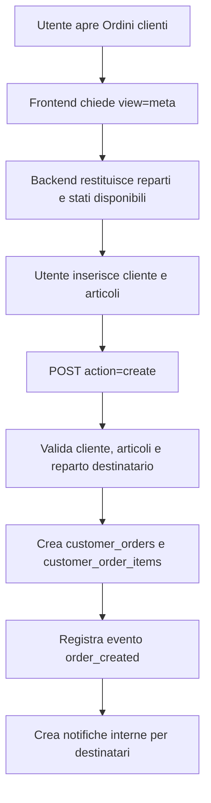
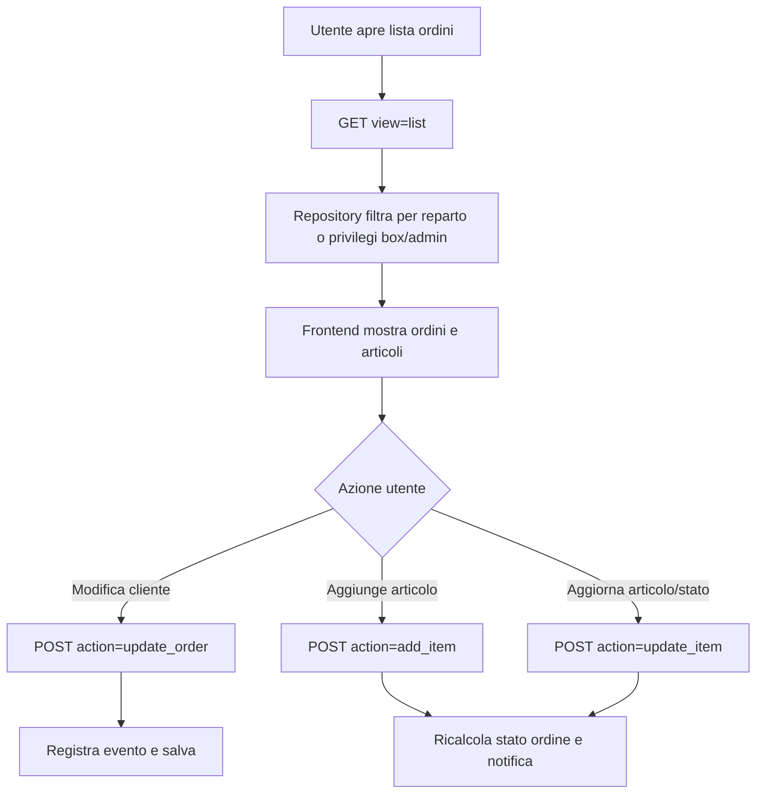

# Modulo Ordini Clienti

## Scopo

Il modulo Ordini Clienti gestisce gli ordini raccolti dal box informazioni o dai reparti: inserimento cliente, articoli richiesti, stato di avanzamento, notifiche interne e consultazione degli ordini aperti o chiusi.

Nota webroot: da `0.15.16` le pagine e gli asset serviti dal browser vivono in `public/`. Nei diagrammi, `connection_files/...` indica l'URL pubblico; il wrapper fisico si trova in `public/connection_files/...`.

## File principali

| Area | File | Responsabilita |
| --- | --- | --- |
| Endpoint pubblico | `connection_files/customer_orders.php` | Wrapper compatibile con il frontend esistente. |
| Endpoint modulo | `modules/customer-orders/php/customer_orders_endpoint.php` | Router HTTP e controlli richiesta. |
| Bootstrap | `modules/customer-orders/php/bootstrap.php` | Sessione, connessione database e header JSON. |
| Supporto risposta | `modules/customer-orders/php/support/response.php` | Output JSON standard. |
| Supporto validazione | `modules/customer-orders/php/support/validation.php` | Stati ordine, normalizzazione cliente e articoli. |
| Permessi | `modules/customer-orders/php/permissions/customer_order_permissions.php` | Accesso reparto, box informazioni e admin. |
| Repository | `modules/customer-orders/php/repositories/customer_order_repository.php` | Query su ordini, articoli, eventi e notifiche. |
| Service | `modules/customer-orders/php/services/customer_order_service.php` | Payload meta/lista e azioni di modifica. |
| UI | `public/assets/js/modules/customer-orders/customer-orders.js` | Vista ordini, filtri, form creazione e aggiornamento stati. |
| CSS | `public/assets/css/modules/customer-orders.css` | Stili della vista ordini clienti. |
| Tabelle | `customer_orders`, `customer_order_items`, `customer_order_events`, `customer_order_notifications` | Persistenza ordini, righe articolo, audit e notifiche. |

## Permessi

| Ruolo | Visibilita | Azioni |
| --- | --- | --- |
| Addetto reparto | Vede gli ordini destinati al proprio reparto o presi in carico da lui. | Crea e aggiorna ordini del proprio reparto. |
| Box informazioni | Vede gli ordini cliente di tutti i reparti gestibili. | Sceglie il reparto destinatario e aggiorna ordini. |
| Capo casse con privilegi box | Si comporta come box informazioni. | Crea e aggiorna ordini su reparti destinatari. |
| Admin (`capo = 3`) | Vede tutti gli ordini cliente. | Crea e aggiorna ordini, utile anche per supporto sviluppo/emergenze. |

## Flusso creazione ordine

## Flusso aggiornamento ordine

## Stati articolo

| Stato | Significato |
| --- | --- |
| `registered` | Ordine appena registrato. |
| `ordered` | Articolo ordinato. |
| `arrived` | Articolo arrivato. |
| `called` | Cliente chiamato. |
| `delivered` | Articolo consegnato. |
| `cancelled` | Riga annullata. |
| `unavailable` | Articolo non disponibile. |

## Note tecniche

- L'URL pubblico non cambia: il frontend continua a usare `connection_files/customer_orders.php`.
- Lo stato complessivo dell'ordine viene ricalcolato dagli stati delle righe articolo.
- Le notifiche interne vengono salvate in `customer_order_notifications`; il centro notifiche legge poi quelle non ancora viste.
- Il modulo usa ancora funzioni condivise di `app_config.php` per reparti e privilegi box, in attesa di un futuro modulo shared piu strutturato.
