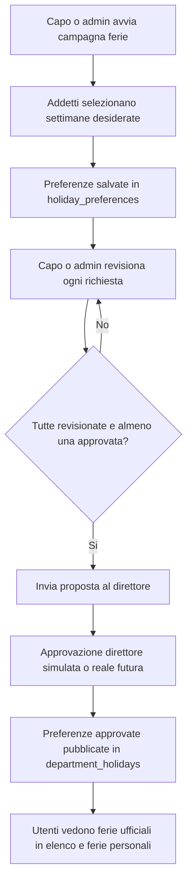
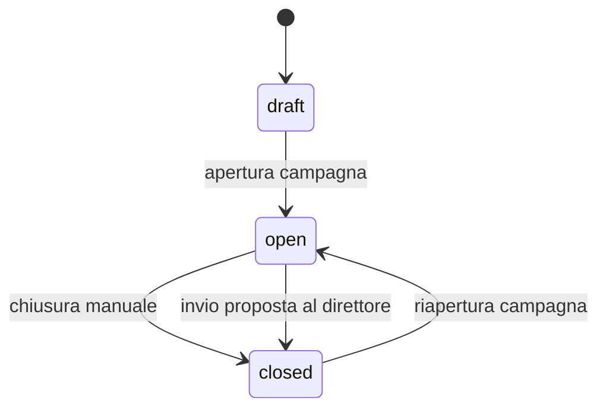
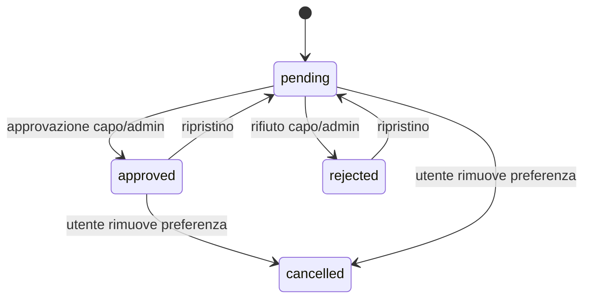
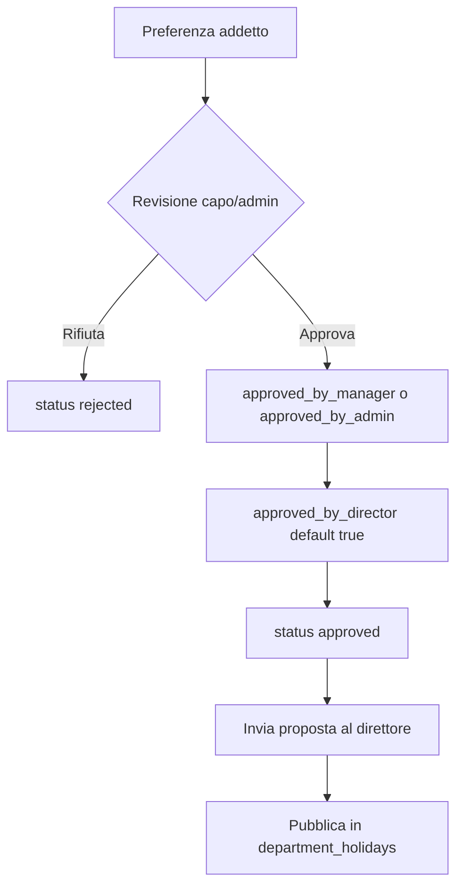

# Modulo Ferie

## Scopo Del Modulo

Il modulo ferie gestisce tre aree dell'app:

- Ferie personali: ogni utente consulta le proprie ferie ufficiali dell'anno.
- Elenco ferie: capo reparto e admin gestiscono le ferie ufficiali del reparto; tutti gli utenti possono consultare la visione condivisa del reparto secondo i permessi previsti dall'app.
- Campagna ferie: capo reparto o admin avviano una raccolta preferenze; gli addetti scelgono le settimane desiderate; capo/admin revisionano; la proposta viene inviata al direttore e pubblicata nelle ferie ufficiali.

La distinzione principale e questa: le preferenze della campagna ferie sono richieste modificabili e da approvare; l'elenco ferie contiene invece le ferie ufficiali pubblicate.

## Schermate

| Schermata | Funzione | File JS principale |
| --- | --- | --- |
| Ferie personali | Mostra countdown, stato ferie corrente e lista ferie annuali dell'utente | `assets/js/modules/holidays/personal.js` |
| Elenco ferie | Mostra griglia settimane, dettaglio settimana, aggiunta/rimozione ferie ufficiali | `assets/js/modules/holidays/department.js` |
| Inserimento ferie | Mostra campagna ferie, preferenze utenti, revisione e invio proposta | `assets/js/modules/holidays/campaign.js` |

Il modulo viene caricato dal loader frontend in `app_core.js` tramite la feature `holidays`:

```js
holidays: [
  "assets/js/modules/holidays/common.js",
  "assets/js/modules/holidays/department.js",
  "assets/js/modules/holidays/personal.js",
  "assets/js/modules/holidays/campaign.js"
]
```

## Workflow Generale



## Ruoli E Permessi

| Ruolo | Valore `capo` | Campagna ferie | Elenco ferie |
| --- | ---: | --- | --- |
| Addetto | `0` | Puo inserire/rimuovere le proprie preferenze se la campagna e aperta | Consulta le ferie ufficiali disponibili |
| Caporeparto | `1` | Puo aprire/chiudere la campagna del proprio reparto, revisionare richieste e inviare proposta | Puo aggiungere/rimuovere ferie ufficiali del proprio reparto |
| Vice | `2` | Attualmente non approva la campagna come capo | Attualmente non gestisce ferie ufficiali come capo |
| Admin | `3` | Puo scegliere il reparto, aprire/chiudere, revisionare e inviare proposta | Puo gestire ferie ufficiali dei reparti |
| Direttore futuro | `4` | Previsto per approvazione finale reale della proposta | Non ancora modellato come UI completa |

Note importanti:

- Admin e futuro direttore possono selezionare il reparto tramite parametro `reparto` quando previsto.
- Il direttore reale non esiste ancora come flusso UI completo; oggi l'invio proposta simula l'approvazione direttore se l'utente non e `capo=4`.
- Le autorizzazioni sono centralizzate in `modules/holidays/php/permissions`.

## Flussi Principali

### Ferie Personali

1. L'utente apre `Ferie personali`.
2. Il frontend chiama `connection_files/holidays.php?view=personal&year=...`.
3. Il backend legge `department_holidays` filtrando per `user_cf` o `person_key` dell'utente.
4. La UI mostra countdown alle prossime ferie, stato corrente e lista ferie passate/presenti/future.

### Gestione Manuale Elenco Ferie

1. Capo/admin apre `Elenco ferie`.
2. La UI mostra una griglia delle settimane dell'anno.
3. Cliccando una settimana si apre il dettaglio.
4. Se l'utente puo gestire, vede la lista persone del reparto e puo aggiungere/rimuovere ferie ufficiali.
5. Le modifiche scrivono direttamente in `department_holidays`.

Questa modalita e pensata per correzioni, inserimenti manuali o modifiche durante l'anno.

### Campagna Ferie

1. Capo/admin apre la campagna del reparto.
2. Gli addetti possono entrare solo se la campagna e aperta.
3. Ogni addetto seleziona o deseleziona settimane.
4. Le preferenze vengono salvate in `holiday_preferences`.
5. Capo/admin revisionano ogni settimana: approva, rifiuta o ripristina.
6. Quando non restano preferenze pending e almeno una e approvata, capo/admin possono inviare la proposta al direttore.
7. Oggi l'approvazione direttore viene simulata, salvo futuro utente `capo=4`.
8. Le preferenze approvate vengono pubblicate in `department_holidays`.

## Stati

### Stato Campagna



| Stato | Significato |
| --- | --- |
| `draft` | Campagna creata o prevista ma non attiva |
| `open` | Gli addetti possono inserire preferenze e capo/admin possono revisionare |
| `closed` | Campagna chiusa; le preferenze non sono piu modificabili dal normale flusso |

### Stato Preferenza



| Stato | Significato |
| --- | --- |
| `pending` | Richiesta inserita ma non ancora revisionata |
| `approved` | Richiesta approvata da capo/admin e direttore simulato/reale |
| `rejected` | Richiesta rifiutata |
| `cancelled` | Richiesta annullata dall'utente o rimossa dal flusso attivo |

## Approvazione E Pubblicazione



Una preferenza e considerata definitivamente approvata quando:

- `approved_by_director = 1`
- e almeno uno tra `approved_by_manager = 1` oppure `approved_by_admin = 1`

Al momento `approved_by_director` e di default `true`, perche il direttore reale non e ancora attivo nel flusso applicativo.

## Tabelle Database

### `department_holidays`

Contiene le ferie ufficiali pubblicate.

Campi principali:

- `reparto`
- `iso_year`
- `iso_week`
- `person_key`
- `user_cf`
- `schedule_name`
- `display_name`
- `created_by_cf`
- `updated_by_cf`

Usata da:

- Ferie personali
- Elenco ferie
- Pubblicazione finale della campagna ferie

### `holiday_campaigns`

Contiene una campagna ferie per reparto e anno.

Campi principali:

- `reparto`
- `holiday_year`
- `status`
- `opened_by_cf`, `opened_at`
- `closed_by_cf`, `closed_at`
- `submitted_to_director`
- `director_approved`
- `director_approval_simulated`

### `holiday_preferences`

Contiene le preferenze settimanali degli utenti durante una campagna.

Campi principali:

- `campaign_id`
- `reparto`
- `iso_year`
- `iso_week`
- `user_cf`
- `person_key`
- `display_name`
- `status`
- `approved_by_manager`
- `approved_by_admin`
- `approved_by_director`
- `decided_by_cf`
- `decided_at`

## Endpoint Pubblici

| Endpoint | Scopo | Implementazione modulare |
| --- | --- | --- |
| `connection_files/holidays.php` | Ferie personali + elenco ferie ufficiali | `modules/holidays/php/department_holidays_endpoint.php` |
| `connection_files/holiday_campaign.php` | Campagna ferie e preferenze | `modules/holidays/php/holiday_campaign_endpoint.php` |

Gli endpoint pubblici restano in `connection_files` per non rompere fetch frontend, notifiche, service worker o link gia distribuiti.

## Struttura Codice

```text
assets/js/modules/holidays/
  common.js
  department.js
  personal.js
  campaign.js

modules/holidays/php/
  bootstrap.php
  department_holidays_endpoint.php
  holiday_campaign_endpoint.php
  permissions/
    holiday_permissions.php
    holiday_campaign_permissions.php
  repositories/
    department_holiday_repository.php
    holiday_campaign_repository.php
    holiday_people_repository.php
  services/
    department_holiday_service.php
    holiday_campaign_service.php
  support/
    response.php
    week.php
```

Responsabilita:

- `endpoint`: legge richiesta, controlla accesso base, chiama service, risponde JSON.
- `service`: coordina il flusso applicativo e costruisce payload.
- `repository`: contiene query e scritture database.
- `permissions`: contiene regole di accesso per ruolo e reparto.
- `support`: contiene helper condivisi piccoli.

## Regole Di Business

- Le ferie ufficiali stanno sempre in `department_holidays`.
- Le preferenze della campagna stanno in `holiday_preferences` e non diventano ufficiali finche la proposta non viene inviata al direttore.
- Capo/admin possono intervenire manualmente su `department_holidays` tramite Elenco ferie.
- La campagna ferie e una raccolta di preferenze, non una pubblicazione immediata.
- L'invio proposta al direttore chiude la campagna e pubblica le preferenze approvate.
- Il direttore e previsto come utente futuro `capo=4`; fino ad allora l'approvazione direttore e simulata.

## Dipendenze Esterne Al Modulo

Il modulo ferie usa alcune funzioni condivise esistenti fuori dal modulo:

- `appIsValidDepartment()` e `appDepartments()` da configurazione/runtime app.
- `app_csrf_request_is_valid()` per protezione POST.
- `normalizzaChiaveAddetto()` dal converter orari per normalizzare nominativi Excel.
- Tabelle orari e mapping per costruire l'anagrafica del reparto quando si aggiungono ferie manualmente.

Queste dipendenze sono candidate future per una cartella `shared`.

## Test Manuali Consigliati

Prima di considerare stabile una modifica al modulo ferie, verificare:

- Ferie personali si apre e mostra countdown/lista ferie.
- Elenco ferie mostra griglia settimane e dettaglio settimana.
- Capo/admin possono aggiungere e rimuovere ferie manuali.
- Addetto vede messaggio se la campagna non e aperta.
- Capo/admin possono aprire campagna, revisionare richieste e inviare proposta.
- Admin vede e usa la selezione reparto nella campagna.
- Dopo invio proposta, le ferie approvate appaiono in Elenco ferie e Ferie personali.

## Test Tecnici Consigliati

- `php -l` su tutti i file `modules/holidays/php`.
- `node --check` sui file `assets/js/modules/holidays`.
- Smoke test CLI degli endpoint pubblici:
  `php connection_files/holidays.php`
  `php connection_files/holiday_campaign.php`
- Controllo cache/versioning PWA quando cambiano asset JS o service worker.

## Punti Futuri

- Creare test automatici backend per campagna ferie e pubblicazione.
- Introdurre il direttore reale `capo=4` con UI dedicata.
- Aggiungere vincoli ferie configurabili, ad esempio massimo persone per reparto/settimana o blackout period.
- Valutare una futura cartella `shared` per permessi generali, reparti, response JSON e helper comuni.
- Migliorare la comunicazione interna durante la campagna, se un giorno si vuole evitare coordinamento esterno.