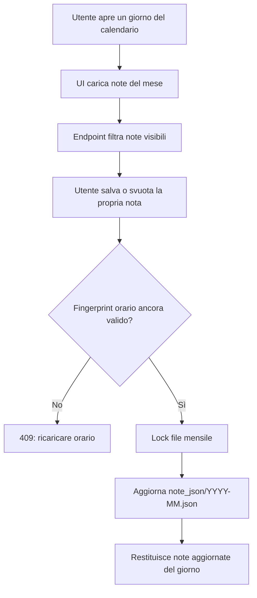
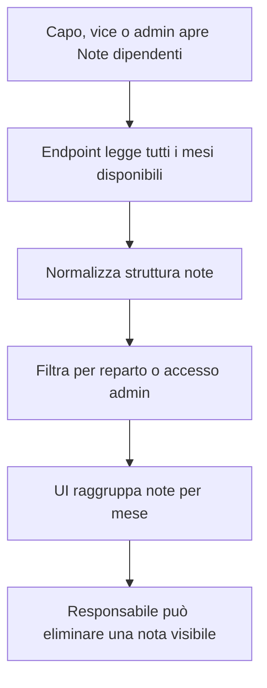

# Modulo Note

## Scopo

Il modulo Note gestisce le note giornaliere legate agli orari. Ogni utente può salvare la propria nota su un giorno specifico; capo, vice e admin possono consultare le note degli utenti secondo i permessi di reparto.

## File principali

| Area | File | Responsabilità |
| --- | --- | --- |
| Endpoint pubblico | `connection_files/note.php` | Wrapper compatibile con il frontend esistente. |
| Endpoint modulo | `modules/notes/php/note_endpoint.php` | Router HTTP e controlli richiesta. |
| Supporto risposta | `modules/notes/php/support/response.php` | Output JSON standard. |
| Supporto storage | `modules/notes/php/support/storage.php` | Lettura, scrittura e lock dei file mensili. |
| Supporto validazione | `modules/notes/php/support/validation.php` | Normalizzazione data e mese. |
| Permessi | `modules/notes/php/permissions/note_permissions.php` | Visibilità note per utente, reparto e admin. |
| Service | `modules/notes/php/services/note_service.php` | Payload GET, salvataggio e cancellazione admin. |
| UI note | `assets/js/modules/notes/notes.js` | Pannello giorno, salvataggio nota, vista note dipendenti. |
| Storage note | `note_json/*.json` | File mensili delle note. |
| Shared orari | `connection_files/schedule_adjustment_lib.php` | Wrapper per fingerprint e controllo versione orario. |

## Permessi

| Ruolo | Lettura | Scrittura |
| --- | --- | --- |
| Addetto | Vede le proprie note e le note visibili sul giorno caricato secondo il filtro backend. | Può salvare o svuotare la propria nota. |
| Vice (`capo = 2`) | Vede le note del proprio reparto. | Può eliminare note visibili nella vista admin. |
| Caporeparto (`capo = 1`) | Vede le note del proprio reparto. | Può eliminare note visibili nella vista admin. |
| Admin (`capo = 3`) | Vede tutte le note. | Può eliminare note nella vista admin. |

## Flusso nota giornaliera

## Flusso vista admin

## Note tecniche

- L'URL pubblico non cambia: il frontend continua a usare `connection_files/note.php`.
- Le note restano su file JSON mensili, protetti da lock per evitare sovrascritture simultanee.
- Il salvataggio confronta la versione orario vista dal client con il fingerprint corrente della settimana; se l'orario è cambiato, il backend risponde con `409` e `schedule_changed = true`.
- La logica è stata spostata in un endpoint di modulo senza cambiare payload o formato dei file.
