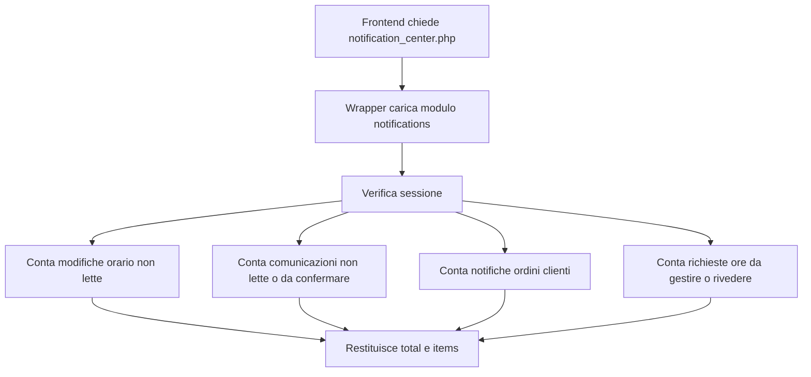
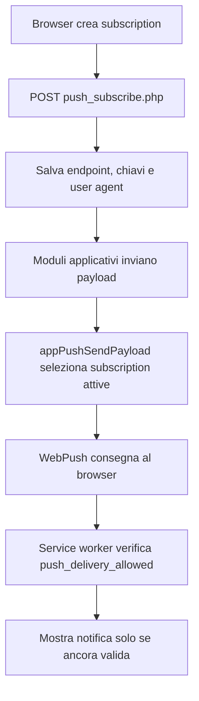

# Modulo Notifiche e Push

## Scopo

Il modulo Notifiche raccoglie il centro notifiche interno, la gestione delle subscription push, la consegna Web Push e le utilita condivise usate da orari, comunicazioni, richieste ore e ordini.

## File principali

| Area | File | Responsabilita |
| --- | --- | --- |
| Bootstrap | `modules/notifications/php/bootstrap.php` | Sessione, configurazione e connessione database. |
| Libreria push | `modules/notifications/php/push/push_lib.php` | VAPID, subscription, invio push, change set orari. |
| Centro notifiche | `modules/notifications/php/endpoints/notification_center_endpoint.php` | Aggrega badge e azioni pendenti. |
| Subscribe | `modules/notifications/php/endpoints/push_subscribe_endpoint.php` | Salva subscription browser. |
| Unsubscribe | `modules/notifications/php/endpoints/push_unsubscribe_endpoint.php` | Disattiva subscription utente. |
| Stato subscription | `modules/notifications/php/endpoints/push_subscription_status_endpoint.php` | Verifica se la subscription e attiva. |
| Verifica consegna SW | `modules/notifications/php/endpoints/push_delivery_allowed_endpoint.php` | Controllo usato dal service worker prima di mostrare una push. |
| Wrapper pubblici | `connection_files/push_*.php`, `connection_files/notification_center.php`, `connection_files/push_lib.php` | Compatibilita con frontend e moduli esistenti. |

## Flusso centro notifiche

## Flusso push browser

## Dati coinvolti

| Tabella/storage | Uso |
| --- | --- |
| `push_subscriptions` | Subscription browser attive o disattivate. |
| `schedule_change_log` | Badge e notifiche modifiche orari. |
| `communication_recipients` | Badge comunicazioni. |
| `customer_order_notifications` | Badge ordini clienti. |
| `schedule_adjustment_requests`, `extra_hour_requests` | Badge richieste ore. |
| `storage/push_vapid.json` | Chiavi VAPID generate o ruotate. |

## Note tecniche

- Gli URL pubblici non cambiano.
- `connection_files/push_lib.php` resta wrapper per i moduli che la includono gia.
- La generazione VAPID resta compatibile con XAMPP/Windows tramite ricerca della configurazione OpenSSL.
- Il service worker continua a chiamare `connection_files/push_delivery_allowed.php`.
