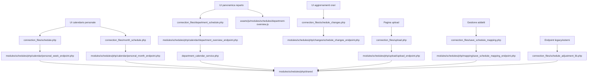
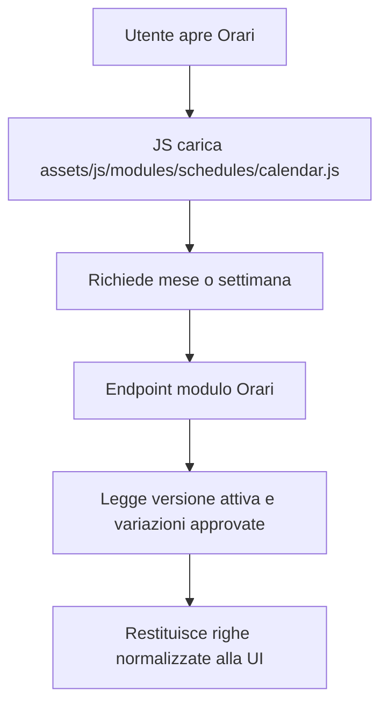
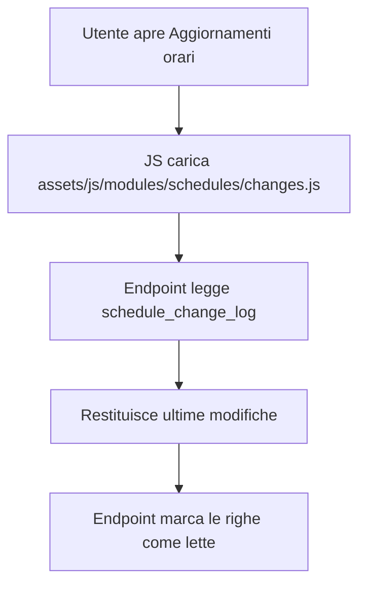
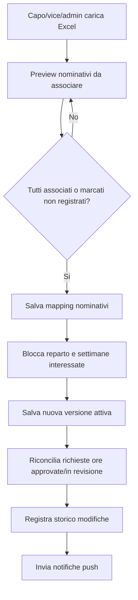
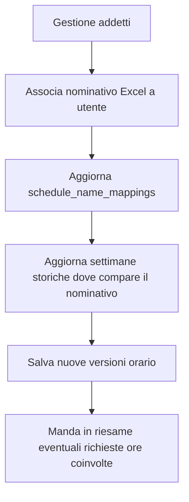

# Modulo Orari

## Scopo

Il modulo Orari e il modulo madre che gestisce la lettura, visualizzazione, caricamento e riconciliazione degli orari. Per ridurre il rischio, il refactor viene diviso in sotto-aree funzionali.

## Sotto-aree previste

| Area | Stato | Responsabilita |
| --- | --- | --- |
| Calendario personale | Scorporato | Lettura settimana e mese dell'utente corrente. |
| Panoramica reparto | Scorporato | Vista caporeparto/admin sugli orari del reparto. |
| Aggiornamenti orari | Scorporato | Storico modifiche e marcatura come lette. |
| Upload orari | Scorporato | Caricamento Excel, parsing, versioni e notifiche. |
| Mapping addetti | Scorporato | Associazione nominativi Excel/utenti, inclusa logica Grocery 1/2. |
| Riconciliazione variazioni | Scorporato | Applicazione delle richieste ore approvate sugli orari effettivi. |
| Supporto condiviso | Scorporato | Funzioni comuni ancora usate da upload, calendario, richieste ore e note. |

## File principali

| Area | File | Responsabilita |
| --- | --- | --- |
| Wrapper settimana personale | `connection_files/schedule.php` | Mantiene URL pubblico per la UI. |
| Wrapper mese personale | `connection_files/month_schedule.php` | Mantiene URL pubblico per la UI. |
| Wrapper panoramica reparto | `connection_files/department_schedule.php` | Mantiene URL pubblico per la UI reparto. |
| Wrapper storico modifiche | `connection_files/schedule_changes.php` | Mantiene URL pubblico per aggiornamenti orari. |
| Bootstrap modulo | `modules/schedules/php/bootstrap.php` | Sessione, connessione, libreria condivisa orari. |
| Risposte JSON | `modules/schedules/php/support/response.php` | Output JSON standard del modulo. |
| Settimane visibili | `modules/schedules/php/support/weeks.php` | Calcolo settimane ISO visibili nel mese. |
| Endpoint settimana | `modules/schedules/php/calendar/personal_week_endpoint.php` | Lettura orario settimanale personale. |
| Endpoint mese | `modules/schedules/php/calendar/personal_month_endpoint.php` | Lettura orario mensile personale. |
| Endpoint reparto | `modules/schedules/php/calendar/department_overview_endpoint.php` | Lettura panoramica reparto. |
| Service reparto | `modules/schedules/php/calendar/services/department_calendar_service.php` | Costruzione elenco persone/giorni/stati reparto. |
| Endpoint modifiche | `modules/schedules/php/changes/schedule_changes_endpoint.php` | Lettura storico modifiche e mark-as-read. |
| Wrapper upload | `connection_files/upload.php` | Mantiene URL pubblico usato dalla pagina upload. |
| Pagina upload | `upload_turni.php` | Entry point pubblico per caricare Excel. |
| Contesto upload | `modules/schedules/php/upload/upload_page_context.php` | Autorizzazione pagina upload e dati reparto. |
| Endpoint upload | `modules/schedules/php/upload/upload_endpoint.php` | Preview file Excel, associazioni temporanee, salvataggio versioni e notifiche. |
| Wrapper mapping | `connection_files/save_schedule_mapping.php` | Mantiene URL pubblico dei form in gestione addetti. |
| Endpoint mapping | `modules/schedules/php/mapping/save_schedule_mapping_endpoint.php` | Salva/rimuove associazioni nominativi Excel e aggiorna gli orari storici. |
| UI calendario | `assets/js/modules/schedules/calendar.js` | Vista calendario personale. |
| UI panoramica reparto | `assets/js/modules/schedules/department-overview.js` | Vista reparto giornaliera/settimanale per caporeparto e admin. |
| UI modifiche | `assets/js/modules/schedules/changes.js` | Vista aggiornamenti orari. |
| UI upload | `assets/js/modules/schedules/upload-page.js` | Gestione preview, mapping e submit upload Excel. |
| Wrapper libreria condivisa | `connection_files/schedule_adjustment_lib.php` | Mantiene compatibilita con endpoint esterni al modulo Orari. |
| Shared Orari | `modules/schedules/php/shared/schedule_adjustment_lib.php` | Carica funzioni comuni per date, turni, file, lock, versioni e riconciliazione. |

## Dipendenze principali

## Tabelle database coinvolte

| Tabella | Uso |
| --- | --- |
| `schedule_upload_versions` | Versioni caricate degli orari. |
| `schedule_active_versions` | Versione attiva per reparto/settimana. |
| `schedule_name_mappings` | Collegamento tra nominativo Excel e utente registrato. |
| `schedule_change_log` | Storico modifiche orari per gli utenti. |
| `schedule_adjustment_requests` | Variazioni turno che possono modificare la vista effettiva. |
| `schedule_week_locks` | Lock di settimana durante operazioni critiche. |
| `schedule_adjustment_day_locks` | Lock per giorno/utente nelle richieste di variazione. |

## Flusso calendario personale

## Flusso aggiornamenti orari

## Flusso upload orari

## Flusso mapping addetti

## Note di refactor

- Gli URL pubblici non cambiano: la UI continua a chiamare `connection_files/*.php`.
- La libreria `connection_files/schedule_adjustment_lib.php` resta come wrapper di compatibilita.
- La logica condivisa e ora in `modules/schedules/php/shared`, divisa per supporto, repository e permessi.
- La UI degli aggiornamenti orari ora e caricata come feature lazy `scheduleChanges`.
- La pagina `upload_turni.php` resta raggiungibile dalla dashboard, mentre `testjs.php` e solo un wrapper di compatibilita.
