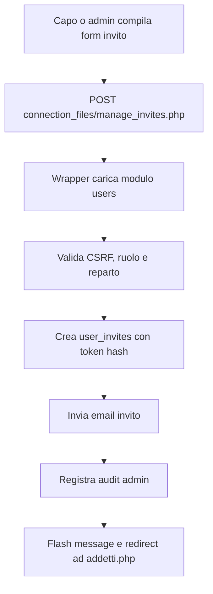
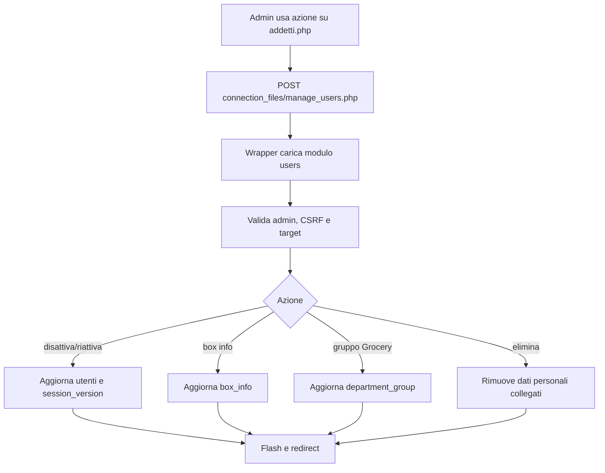

# Modulo Utenti, Addetti e Inviti

## Scopo

Il modulo Utenti raccoglie la logica backend legata alla gestione degli account, degli addetti e degli inviti. In questa fase il modulo copre gli endpoint operativi di gestione utenti e inviti, piu le librerie condivise per permessi invito e audit admin.

Le pagine UI principali `addetti.php` e `admin_console.php` restano nella root e continuano a usare i wrapper pubblici in `connection_files`.

## File principali

| Area | File | Responsabilita |
| --- | --- | --- |
| Endpoint pubblico utenti | `connection_files/manage_users.php` | Wrapper compatibile con i form esistenti. |
| Endpoint pubblico inviti | `connection_files/manage_invites.php` | Wrapper compatibile con i form esistenti. |
| Libreria pubblica inviti | `connection_files/invite_lib.php` | Wrapper per le pagine che includono le funzioni invito. |
| Libreria pubblica audit | `connection_files/admin_audit_lib.php` | Wrapper per le pagine che registrano audit admin. |
| Bootstrap modulo | `modules/users/php/bootstrap.php` | Sessione, configurazione e connessione database. |
| Audit admin | `modules/users/php/admin/audit.php` | Scrittura eventi in `admin_audit_log`. |
| Libreria inviti | `modules/users/php/invites/invite_lib.php` | Permessi, stati, token e rigenerazione inviti. |
| Endpoint inviti | `modules/users/php/invites/manage_invites_endpoint.php` | Creazione, revoca, rigenerazione e test email invito. |
| Endpoint utenti | `modules/users/php/management/manage_users_endpoint.php` | Disattivazione, riattivazione, eliminazione, box info e gruppo Grocery. |
| UI addetti | `addetti.php` | Pagina visuale ancora da scorporare. |
| UI console admin | `admin_console.php` | Console visuale ancora da scorporare. |

## Permessi

| Ruolo | Utenti | Inviti |
| --- | --- | --- |
| Addetto (`capo = 0`) | Nessuna gestione account. | Nessuna gestione inviti. |
| Vice (`capo = 2`) | Nessuna gestione account globale in questa fase. | Nessuna gestione inviti. |
| Caporeparto (`capo = 1`) | Gestione limitata tramite pagine reparto, dove prevista. | Puo invitare addetti e vice del proprio reparto. |
| Admin (`capo = 3`) | Puo gestire account non admin: disattivare, riattivare, eliminare, box info, gruppo Grocery. | Puo invitare addetti, vice e capi reparto; puo inviare email di test. |

## Flusso invito

## Flusso gestione account

## Dati coinvolti

| Tabella o storage | Uso |
| --- | --- |
| `utenti` | Account registrati, ruolo, reparto, box info e gruppo operativo. |
| `user_invites` | Inviti pendenti, revocati, scaduti o accettati. |
| `admin_audit_log` | Audit delle azioni admin e inviti. |
| `push_subscriptions` | Disattivate quando un account viene disattivato o rimosso. |
| `communication_*` | Pulizia comunicazioni collegate in caso di eliminazione account. |
| `schedule_*`, `extra_hour_requests` | Pulizia richieste e log legati all'utente eliminato. |
| `customer_order_*` | Rimozione riferimenti personali dagli ordini cliente. |
| `note_json/*.json` | Pulizia note personali quando un account viene eliminato. |

## Note tecniche

- Gli URL pubblici non cambiano: i form continuano a usare `connection_files/manage_users.php` e `connection_files/manage_invites.php`.
- Le librerie `connection_files/invite_lib.php` e `connection_files/admin_audit_lib.php` restano disponibili come wrapper per compatibilita con `addetti.php`, `admin_console.php` e `accept_invite.php`.
- La directory `modules/` e stata aggiunta alle regole di blocco HTTP: il browser passa dai wrapper pubblici, mentre gli include PHP interni continuano a funzionare.
- La prossima fase naturale e lo scorporo delle pagine UI `addetti.php` e `admin_console.php`, separando query, rendering e azioni.
